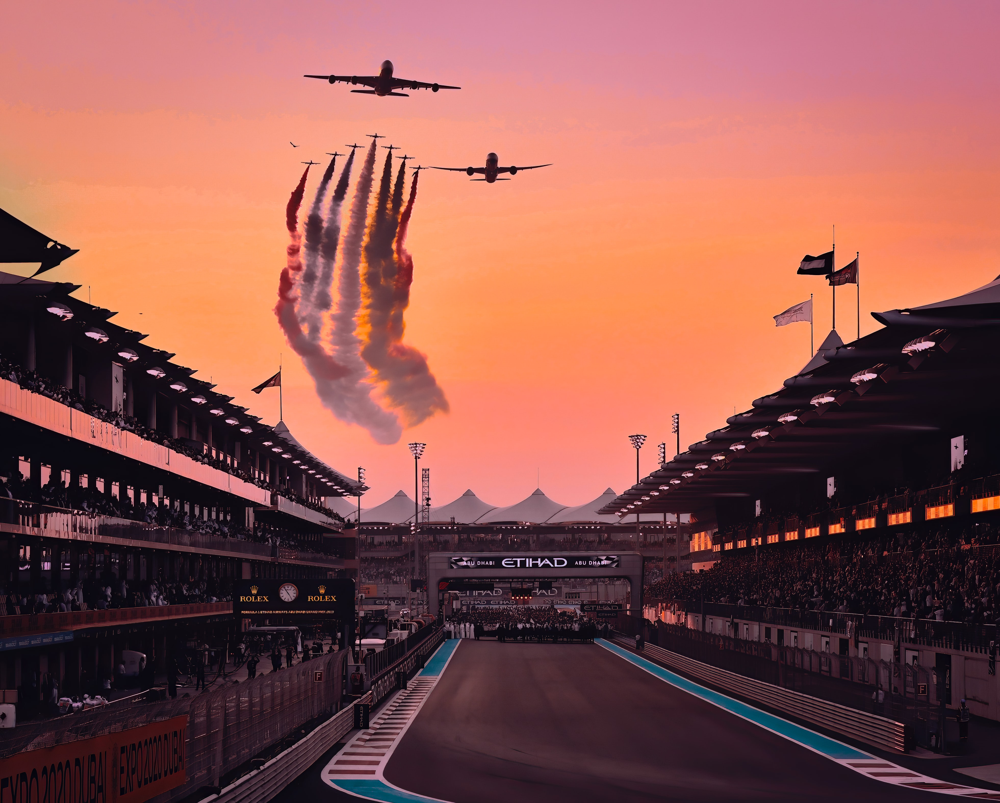

```{r setup, include = F}

knitr::opts_chunk$set(
        echo = F,
        message = F,
        warning = F,
        scipen = 999,
        fig.height = 12,
        fig.width = 14,
        fig.align = "center"
)

#############################################################################
# Ingest
#############################################################################

rm(list = ls())
library(mossR)
library(gridExtra)

lap_times <- read.csv("data/lap_times.csv")
pit_stops <- read.csv("data/pit_stops.csv")
drivers <- read.csv("data/drivers.csv")
races <- read.csv("data/races.csv")
circuits <- read.csv("data/circuits.csv")
results <- read.csv("data/results.csv")
constructors <- read.csv("data/constructors.csv")
status <- read.csv("data/status.csv")

laptimes <- lap_times %>% 
        select(
                driverId,
                RaceID = raceId,
                Lap = lap,
                CurrentPosition = position,
                Laptime = milliseconds
        ) %>% 
        left_join(
                by = "driverId",
                drivers %>% 
                        mutate(
                                DriverName = paste(sep = " ", forename, surname)
                        ) %>% 
                        select(
                                driverId,
                                DriverName
                        )
        ) %>% 
        left_join(
                by = c("RaceID" = "raceId"),
                races %>% 
                        select(
                                raceId,
                                circuitId,
                                Year = year,
                                Round = round,
                                RaceDate = date,
                                RaceName = name
                        )
        ) %>% 
        left_join(
                by = "circuitId",
                circuits %>% 
                        select(
                                circuitId,
                                CircuitRef = circuitRef,
                                CircuitName = name,
                                Lat = lat,
                                Lng = lng,
                                Alt = alt,
                                Location = location,
                                Country = country
                        )
        ) %>% 
        left_join(
                by = c("RaceID" = "raceId", "driverId"),
                results %>% 
                        select(
                                raceId,
                                driverId,
                                constructorId,
                                GridSpot = grid,
                                statusId
                        ) %>% 
                        left_join(
                                by = "statusId",
                                status %>% 
                                        select(
                                                statusId,
                                                Status = status
                                        )
                        )
        ) %>% 
        left_join(
                by = c("constructorId"),
                constructors %>% 
                        select(
                                constructorId,
                                TeamName = name
                        )
        ) %>% 
        select(
                -driverId,
                -constructorId,
                -circuitId,
                -statusId
        ) %>% 
        group_by(
                RaceID
        ) %>% 
        mutate(
                RaceLaps = max(Lap, na.rm = T)
        ) %>% 
        group_by(
                RaceID,
                DriverName
        ) %>% 
        mutate(
                RaceTime = cumsum(Laptime)
        )

#############################################################################
# Max vs Lewis 2021
#############################################################################

laptimes_lm2021 <- laptimes %>% 
        filter(
                Year == 2021,
                DriverName %in% c("Lewis Hamilton", "Max Verstappen")
        ) %>% as.data.frame()

```

## Intro

This is an R Markdown document. Markdown is a simple formatting syntax for authoring HTML, PDF, and MS Word documents. For more details on using R Markdown see <http://rmarkdown.rstudio.com>.

```{r intro}

laptimes_lm2021_diffs <- laptimes_lm2021 %>% 
        filter(
                !(Round %in% c(10, 12))
        ) %>% 
        pivot_wider(
                id_cols = c(RaceID, Round, RaceName, Lap, RaceLaps),
                names_from = DriverName,
                values_from = RaceTime
        ) %>% 
        mutate(
                TimeDiff = (`Lewis Hamilton` - `Max Verstappen`) / 1000
        ) %>% 
        group_by(
                Round
        ) %>% 
        mutate(
                MaxDiff = max(abs(TimeDiff), na.rm = T)
        )

laptimes_lm2021_diffs %>% 
        mutate(
                RoundRace = paste(sep = " ", str_pad(Round, 2, pad = "0"), RaceName)
        ) %>% 
        ggplot() +
        geom_hline(aes(yintercept = 0), linetype = "dotted", color = "grey50") +
        geom_line(aes(x = Lap, y = TimeDiff), color = "black", linewidth = 0.8) +
        #geom_point(aes(x = Lap, y = MaxDiff), color = "navy") +
        #geom_point(aes(x = Lap, y = -MaxDiff), color = "seagreen") +
        geom_text(aes(x = 1, y = -50, label = "Lewis"), color = "seagreen", hjust = 0) +
        geom_text(aes(x = 1, y = 50, label = "Max"), color = "navy", hjust = 0) +
        theme_msc() +
        theme(
                axis.text.x = element_blank(),
                axis.text.y = element_text(size = 9),
                strip.text = element_text(size = 10),
                strip.background = element_rect(color = "grey50")
        ) +
        labs(
                title = "Race Length Time Differences",
                subtitle = "Race 10 saw Max crash out on the opening lap at Silverstone,\nwhile race 12 at Spa was cancelled.",
                x = "Time",
                y = "Lead"
        ) +
        scale_y_continuous(
                limits = c(-80, 80),
                labels = function(x) {paste0(abs(x), " secs")}
        ) +
        facet_wrap(
                RoundRace ~ .
        )

```

## Round 1

```{r round1}

plt_multi01 <- list(
        laptimes_lm2021 %>% 
                filter(
                        Round == 1
                ) %>% 
                ggplot() +
                geom_line(aes(x = Lap, y = Laptime, group = DriverName, color = DriverName), size = 1) +
                geom_point(aes(x = Lap, y = Laptime, color = DriverName), size = 3) +
                theme_msc() +
                theme(
                        panel.grid.major.y = element_line(linewidth = 0.5, linetype = "dashed", color = "grey80"),
                        axis.text.x = element_blank(),
                        legend.position = "top"
                ) +
                labs(
                        title = "Lap Times During Round 1",
                        subtitle = "Bahrain Grand Prix",
                        x = "",
                        y = "Lap",
                        color = ""
                ) +
                scale_y_continuous(
                        labels = function(x) {paste0(floor(x / 60000), ":", str_pad((x / 1000) %% 60, 2, pad = "0"))}
                ) +
                scale_color_manual(
                        values = c(
                                "Lewis Hamilton" = "seagreen",
                                "Max Verstappen" = "navy"
                        )
                ) +
                coord_cartesian(
                        ylim = c(92500, 100000)
                ),
        laptimes_lm2021_diffs %>% 
                filter(
                        Round == 1
                ) %>% 
                mutate(
                        RoundRace = paste(sep = " ", str_pad(Round, 2, pad = "0"), RaceName)
                ) %>% 
                ggplot() +
                geom_hline(aes(yintercept = 0), linetype = "dotted", color = "grey50") +
                geom_line(aes(x = Lap, y = TimeDiff), color = "black", linewidth = 0.8) +
                #geom_point(aes(x = Lap, y = MaxDiff), color = "navy") +
                #geom_point(aes(x = Lap, y = -MaxDiff), color = "seagreen") +
                geom_text(aes(x = 1, y = -MaxDiff, label = "Lewis"), color = "seagreen", hjust = 0) +
                geom_text(aes(x = 1, y = MaxDiff, label = "Max"), color = "navy", hjust = 0) +
                geom_text(aes(x = Lap, y = ifelse(Lap == RaceLaps, TimeDiff + ifelse(TimeDiff < 0, -3, 3), NA), label = TimeDiff, color = ifelse(TimeDiff < 0, "Lewis", "Max")), size = 5) +
                theme_msc() +
                theme(
                        axis.text = element_text(size = 11),
                        strip.text = element_text(size = 10),
                        strip.background = element_rect(color = "grey50")
                ) +
                labs(
                        x = "Lap Time",
                        y = "Lead"
                ) +
                scale_y_continuous(
                        labels = function(x) {paste0(abs(x), " secs")}
                ) +
                scale_color_manual(
                        values = c(
                                "Lewis" = "seagreen",
                                "Max" = "navy"
                        )
                )
)

grid.arrange(
        plt_multi01[[1]],
        plt_multi01[[2]]
)

```

## Round 2

```{r round2}

plt_multi02 <- list(
        laptimes_lm2021 %>% 
                filter(
                        Round == 2
                ) %>% 
                ggplot() +
                geom_line(aes(x = Lap, y = Laptime, group = DriverName, color = DriverName), size = 1) +
                geom_point(aes(x = Lap, y = Laptime, color = DriverName), size = 3) +
                theme_msc() +
                theme(
                        panel.grid.major.y = element_line(linewidth = 0.5, linetype = "dashed", color = "grey80"),
                        axis.text.x = element_blank(),
                        legend.position = "top"
                ) +
                labs(
                        title = "Lap Times During Round 2",
                        subtitle = "Emilia Romagna Grand Prix",
                        x = "",
                        y = "Lap",
                        color = ""
                ) +
                scale_y_continuous(
                        labels = function(x) {paste0(floor(x / 60000), ":", str_pad((x / 1000) %% 60, 2, pad = "0"))}
                ) +
                scale_color_manual(
                        values = c(
                                "Lewis Hamilton" = "seagreen",
                                "Max Verstappen" = "navy"
                        )
                ) +
                coord_cartesian(
                        ylim = c(75000, 115000)
                ),
        laptimes_lm2021_diffs %>% 
                filter(
                        Round == 2
                ) %>% 
                mutate(
                        RoundRace = paste(sep = " ", str_pad(Round, 2, pad = "0"), RaceName)
                ) %>% 
                ggplot() +
                geom_hline(aes(yintercept = 0), linetype = "dotted", color = "grey50") +
                geom_line(aes(x = Lap, y = TimeDiff), color = "black", linewidth = 0.8) +
                #geom_point(aes(x = Lap, y = MaxDiff), color = "navy") +
                #geom_point(aes(x = Lap, y = -MaxDiff), color = "seagreen") +
                geom_text(aes(x = 1, y = -MaxDiff, label = "Lewis"), color = "seagreen", hjust = 0) +
                geom_text(aes(x = 1, y = MaxDiff, label = "Max"), color = "navy", hjust = 0) +
                geom_text(aes(x = Lap, y = ifelse(Lap == RaceLaps, TimeDiff + ifelse(TimeDiff < 0, -3, 3), NA), label = TimeDiff, color = ifelse(TimeDiff < 0, "Lewis", "Max")), size = 5) +
                theme_msc() +
                theme(
                        axis.text = element_text(size = 11),
                        strip.text = element_text(size = 10),
                        strip.background = element_rect(color = "grey50")
                ) +
                labs(
                        x = "Lap Time",
                        y = "Lead"
                ) +
                scale_y_continuous(
                        labels = function(x) {paste0(abs(x), " secs")}
                ) +
                scale_color_manual(
                        values = c(
                                "Lewis" = "seagreen",
                                "Max" = "navy"
                        )
                ) +
                coord_cartesian(
                        ylim = c(-30, 30)
                )
)

grid.arrange(
        plt_multi02[[1]],
        plt_multi02[[2]]
)

```

## Round 3

```{r round3}

plt_multi03 <- list(
        laptimes_lm2021 %>% 
                filter(
                        Round == 3
                ) %>% 
                ggplot() +
                geom_line(aes(x = Lap, y = Laptime, group = DriverName, color = DriverName), size = 1) +
                geom_point(aes(x = Lap, y = Laptime, color = DriverName), size = 3) +
                theme_msc() +
                theme(
                        panel.grid.major.y = element_line(linewidth = 0.5, linetype = "dashed", color = "grey80"),
                        axis.text.x = element_blank(),
                        legend.position = "top"
                ) +
                labs(
                        title = "Lap Times During Round 3",
                        subtitle = "Portuguese Grand Prix",
                        x = "",
                        y = "Lap",
                        color = ""
                ) +
                scale_y_continuous(
                        labels = function(x) {paste0(floor(x / 60000), ":", str_pad((x / 1000) %% 60, 2, pad = "0"))}
                ) +
                scale_color_manual(
                        values = c(
                                "Lewis Hamilton" = "seagreen",
                                "Max Verstappen" = "navy"
                        )
                ) +
                coord_cartesian(
                        ylim = c(79000, 85000)
                ),
        laptimes_lm2021_diffs %>% 
                filter(
                        Round == 3
                ) %>% 
                mutate(
                        RoundRace = paste(sep = " ", str_pad(Round, 2, pad = "0"), RaceName)
                ) %>% 
                ggplot() +
                geom_hline(aes(yintercept = 0), linetype = "dotted", color = "grey50") +
                geom_line(aes(x = Lap, y = TimeDiff), color = "black", linewidth = 0.8) +
                #geom_point(aes(x = Lap, y = MaxDiff), color = "navy") +
                #geom_point(aes(x = Lap, y = -MaxDiff), color = "seagreen") +
                geom_text(aes(x = 1, y = -MaxDiff, label = "Lewis"), color = "seagreen", hjust = 0) +
                geom_text(aes(x = 1, y = MaxDiff, label = "Max"), color = "navy", hjust = 0) +
                geom_text(aes(x = Lap, y = ifelse(Lap == RaceLaps, TimeDiff + ifelse(TimeDiff < 0, -3, 3), NA), label = TimeDiff, color = ifelse(TimeDiff < 0, "Lewis", "Max")), size = 5) +
                theme_msc() +
                theme(
                        axis.text = element_text(size = 11),
                        strip.text = element_text(size = 10),
                        strip.background = element_rect(color = "grey50")
                ) +
                labs(
                        x = "Lap Time",
                        y = "Lead"
                ) +
                scale_y_continuous(
                        labels = function(x) {paste0(abs(x), " secs")}
                ) +
                scale_color_manual(
                        values = c(
                                "Lewis" = "seagreen",
                                "Max" = "navy"
                        )
                )
)

grid.arrange(
        plt_multi03[[1]],
        plt_multi03[[2]]
)

```

## Round 4

```{r round4}

plt_multi04 <- list(
        laptimes_lm2021 %>% 
                filter(
                        Round == 4
                ) %>% 
                ggplot() +
                geom_line(aes(x = Lap, y = Laptime, group = DriverName, color = DriverName), size = 1) +
                geom_point(aes(x = Lap, y = Laptime, color = DriverName), size = 3) +
                theme_msc() +
                theme(
                        panel.grid.major.y = element_line(linewidth = 0.5, linetype = "dashed", color = "grey80"),
                        axis.text.x = element_blank(),
                        legend.position = "top"
                ) +
                labs(
                        title = "Lap Times During Round 4",
                        subtitle = "Spanish Grand Prix",
                        x = "",
                        y = "Lap",
                        color = ""
                ) +
                scale_y_continuous(
                        labels = function(x) {paste0(floor(x / 60000), ":", str_pad((x / 1000) %% 60, 2, pad = "0"))}
                ) +
                scale_color_manual(
                        values = c(
                                "Lewis Hamilton" = "seagreen",
                                "Max Verstappen" = "navy"
                        )
                ) +
                coord_cartesian(
                        ylim = c(75000, 90000)
                ),
        laptimes_lm2021_diffs %>% 
                filter(
                        Round == 4
                ) %>% 
                mutate(
                        RoundRace = paste(sep = " ", str_pad(Round, 2, pad = "0"), RaceName)
                ) %>% 
                ggplot() +
                geom_hline(aes(yintercept = 0), linetype = "dotted", color = "grey50") +
                geom_line(aes(x = Lap, y = TimeDiff), color = "black", linewidth = 0.8) +
                #geom_point(aes(x = Lap, y = MaxDiff), color = "navy") +
                #geom_point(aes(x = Lap, y = -MaxDiff), color = "seagreen") +
                geom_text(aes(x = 1, y = -MaxDiff, label = "Lewis"), color = "seagreen", hjust = 0) +
                geom_text(aes(x = 1, y = MaxDiff, label = "Max"), color = "navy", hjust = 0) +
                geom_text(aes(x = Lap, y = ifelse(Lap == RaceLaps, TimeDiff + ifelse(TimeDiff < 0, -3, 3), NA), label = TimeDiff, color = ifelse(TimeDiff < 0, "Lewis", "Max")), size = 5) +
                theme_msc() +
                theme(
                        axis.text = element_text(size = 11),
                        strip.text = element_text(size = 10),
                        strip.background = element_rect(color = "grey50")
                ) +
                labs(
                        x = "Lap Time",
                        y = "Lead"
                ) +
                scale_y_continuous(
                        labels = function(x) {paste0(abs(x), " secs")}
                ) +
                scale_color_manual(
                        values = c(
                                "Lewis" = "seagreen",
                                "Max" = "navy"
                        )
                )
)

grid.arrange(
        plt_multi04[[1]],
        plt_multi04[[2]]
)

```

## Round 5

```{r round5}

plt_multi05 <- list(
        laptimes_lm2021 %>% 
                filter(
                        Round == 5
                ) %>% 
                ggplot() +
                geom_line(aes(x = Lap, y = Laptime, group = DriverName, color = DriverName), size = 1) +
                geom_point(aes(x = Lap, y = Laptime, color = DriverName), size = 3) +
                theme_msc() +
                theme(
                        panel.grid.major.y = element_line(linewidth = 0.5, linetype = "dashed", color = "grey80"),
                        axis.text.x = element_blank(),
                        legend.position = "top"
                ) +
                labs(
                        title = "Lap Times During Round 5",
                        subtitle = "Monaco Grand Prix",
                        x = "",
                        y = "Lap",
                        color = ""
                ) +
                scale_y_continuous(
                        labels = function(x) {paste0(floor(x / 60000), ":", str_pad((x / 1000) %% 60, 2, pad = "0"))}
                ) +
                scale_color_manual(
                        values = c(
                                "Lewis Hamilton" = "seagreen",
                                "Max Verstappen" = "navy"
                        )
                ) +
                coord_cartesian(
                        ylim = c(75000, 82000)
                ),
        laptimes_lm2021_diffs %>% 
                filter(
                        Round == 5
                ) %>% 
                mutate(
                        RoundRace = paste(sep = " ", str_pad(Round, 2, pad = "0"), RaceName)
                ) %>% 
                ggplot() +
                geom_hline(aes(yintercept = 0), linetype = "dotted", color = "grey50") +
                geom_line(aes(x = Lap, y = TimeDiff), color = "black", linewidth = 0.8) +
                #geom_point(aes(x = Lap, y = MaxDiff), color = "navy") +
                #geom_point(aes(x = Lap, y = -MaxDiff), color = "seagreen") +
                geom_text(aes(x = 1, y = -MaxDiff, label = "Lewis"), color = "seagreen", hjust = 0) +
                geom_text(aes(x = 1, y = MaxDiff, label = "Max"), color = "navy", hjust = 0) +
                geom_text(aes(x = Lap, y = ifelse(Lap == RaceLaps, TimeDiff + ifelse(TimeDiff < 0, -3, 3), NA), label = TimeDiff, color = ifelse(TimeDiff < 0, "Lewis", "Max")), size = 5) +
                theme_msc() +
                theme(
                        axis.text = element_text(size = 11),
                        strip.text = element_text(size = 10),
                        strip.background = element_rect(color = "grey50")
                ) +
                labs(
                        x = "Lap Time",
                        y = "Lead"
                ) +
                scale_y_continuous(
                        labels = function(x) {paste0(abs(x), " secs")}
                ) +
                scale_color_manual(
                        values = c(
                                "Lewis" = "seagreen",
                                "Max" = "navy"
                        )
                )
)

grid.arrange(
        plt_multi05[[1]],
        plt_multi05[[2]]
)

```

## Round 6

```{r round6}

plt_multi06 <- list(
        laptimes_lm2021 %>% 
                filter(
                        Round == 6
                ) %>% 
                ggplot() +
                geom_line(aes(x = Lap, y = Laptime, group = DriverName, color = DriverName), size = 1) +
                geom_point(aes(x = Lap, y = Laptime, color = DriverName), size = 3) +
                theme_msc() +
                theme(
                        panel.grid.major.y = element_line(linewidth = 0.5, linetype = "dashed", color = "grey80"),
                        axis.text.x = element_blank(),
                        legend.position = "top"
                ) +
                labs(
                        title = "Lap Times During Round 6",
                        subtitle = "Azerbaijan Grand Prix",
                        x = "",
                        y = "Lap",
                        color = ""
                ) +
                scale_y_continuous(
                        labels = function(x) {paste0(floor(x / 60000), ":", str_pad((x / 1000) %% 60, 2, pad = "0"))}
                ) +
                scale_color_manual(
                        values = c(
                                "Lewis Hamilton" = "seagreen",
                                "Max Verstappen" = "navy"
                        )
                ) +
                coord_cartesian(
                        ylim = c(103000, 110000)
                ),
        laptimes_lm2021_diffs %>% 
                filter(
                        Round == 6
                ) %>% 
                mutate(
                        RoundRace = paste(sep = " ", str_pad(Round, 2, pad = "0"), RaceName)
                ) %>% 
                ggplot() +
                geom_hline(aes(yintercept = 0), linetype = "dotted", color = "grey50") +
                geom_line(aes(x = Lap, y = TimeDiff), color = "black", linewidth = 0.8) +
                #geom_point(aes(x = Lap, y = MaxDiff), color = "navy") +
                #geom_point(aes(x = Lap, y = -MaxDiff), color = "seagreen") +
                geom_text(aes(x = 1, y = -MaxDiff, label = "Lewis"), color = "seagreen", hjust = 0) +
                geom_text(aes(x = 1, y = MaxDiff, label = "Max"), color = "navy", hjust = 0) +
                geom_text(aes(x = Lap, y = ifelse(Lap == RaceLaps, TimeDiff + ifelse(TimeDiff < 0, -3, 3), NA), label = TimeDiff, color = ifelse(TimeDiff < 0, "Lewis", "Max")), size = 5) +
                theme_msc() +
                theme(
                        axis.text = element_text(size = 11),
                        strip.text = element_text(size = 10),
                        strip.background = element_rect(color = "grey50")
                ) +
                labs(
                        x = "Lap Time",
                        y = "Lead"
                ) +
                scale_y_continuous(
                        labels = function(x) {paste0(abs(x), " secs")}
                ) +
                scale_color_manual(
                        values = c(
                                "Lewis" = "seagreen",
                                "Max" = "navy"
                        )
                )
)

grid.arrange(
        plt_multi06[[1]],
        plt_multi06[[2]]
)

```

## Round 7

```{r round7}

plt_multi07 <- list(
        laptimes_lm2021 %>% 
                filter(
                        Round == 7
                ) %>% 
                ggplot() +
                geom_line(aes(x = Lap, y = Laptime, group = DriverName, color = DriverName), size = 1) +
                geom_point(aes(x = Lap, y = Laptime, color = DriverName), size = 3) +
                theme_msc() +
                theme(
                        panel.grid.major.y = element_line(linewidth = 0.5, linetype = "dashed", color = "grey80"),
                        axis.text.x = element_blank(),
                        legend.position = "top"
                ) +
                labs(
                        title = "Lap Times During Round 7",
                        subtitle = "French Grand Prix",
                        x = "",
                        y = "Lap",
                        color = ""
                ) +
                scale_y_continuous(
                        labels = function(x) {paste0(floor(x / 60000), ":", str_pad((x / 1000) %% 60, 2, pad = "0"))}
                ) +
                scale_color_manual(
                        values = c(
                                "Lewis Hamilton" = "seagreen",
                                "Max Verstappen" = "navy"
                        )
                ) +
                coord_cartesian(
                        ylim = c(95000, 102000)
                ),
        laptimes_lm2021_diffs %>% 
                filter(
                        Round == 7
                ) %>% 
                mutate(
                        RoundRace = paste(sep = " ", str_pad(Round, 2, pad = "0"), RaceName)
                ) %>% 
                ggplot() +
                geom_hline(aes(yintercept = 0), linetype = "dotted", color = "grey50") +
                geom_line(aes(x = Lap, y = TimeDiff), color = "black", linewidth = 0.8) +
                #geom_point(aes(x = Lap, y = MaxDiff), color = "navy") +
                #geom_point(aes(x = Lap, y = -MaxDiff), color = "seagreen") +
                geom_text(aes(x = 1, y = -MaxDiff, label = "Lewis"), color = "seagreen", hjust = 0) +
                geom_text(aes(x = 1, y = MaxDiff, label = "Max"), color = "navy", hjust = 0) +
                geom_text(aes(x = Lap, y = ifelse(Lap == RaceLaps, TimeDiff + ifelse(TimeDiff < 0, -3, 3), NA), label = TimeDiff, color = ifelse(TimeDiff < 0, "Lewis", "Max")), size = 5) +
                theme_msc() +
                theme(
                        axis.text = element_text(size = 11),
                        strip.text = element_text(size = 10),
                        strip.background = element_rect(color = "grey50")
                ) +
                labs(
                        x = "Lap Time",
                        y = "Lead"
                ) +
                scale_y_continuous(
                        labels = function(x) {paste0(abs(x), " secs")}
                ) +
                scale_color_manual(
                        values = c(
                                "Lewis" = "seagreen",
                                "Max" = "navy"
                        )
                )
)

grid.arrange(
        plt_multi07[[1]],
        plt_multi07[[2]]
)

```

## Round 8

```{r round8}

plt_multi08 <- list(
        laptimes_lm2021 %>% 
                filter(
                        Round == 8
                ) %>% 
                ggplot() +
                geom_line(aes(x = Lap, y = Laptime, group = DriverName, color = DriverName), size = 1) +
                geom_point(aes(x = Lap, y = Laptime, color = DriverName), size = 3) +
                theme_msc() +
                theme(
                        panel.grid.major.y = element_line(linewidth = 0.5, linetype = "dashed", color = "grey80"),
                        axis.text.x = element_blank(),
                        legend.position = "top"
                ) +
                labs(
                        title = "Lap Times During Round 8",
                        subtitle = "Styrian Grand Prix",
                        x = "",
                        y = "Lap",
                        color = ""
                ) +
                scale_y_continuous(
                        labels = function(x) {paste0(floor(x / 60000), ":", str_pad((x / 1000) %% 60, 2, pad = "0"))}
                ) +
                scale_color_manual(
                        values = c(
                                "Lewis Hamilton" = "seagreen",
                                "Max Verstappen" = "navy"
                        )
                ) +
                coord_cartesian(
                        ylim = c(65000, 72000)
                ),
        laptimes_lm2021_diffs %>% 
                filter(
                        Round == 8
                ) %>% 
                mutate(
                        RoundRace = paste(sep = " ", str_pad(Round, 2, pad = "0"), RaceName)
                ) %>% 
                ggplot() +
                geom_hline(aes(yintercept = 0), linetype = "dotted", color = "grey50") +
                geom_line(aes(x = Lap, y = TimeDiff), color = "black", linewidth = 0.8) +
                #geom_point(aes(x = Lap, y = MaxDiff), color = "navy") +
                #geom_point(aes(x = Lap, y = -MaxDiff), color = "seagreen") +
                geom_text(aes(x = 1, y = -MaxDiff, label = "Lewis"), color = "seagreen", hjust = 0) +
                geom_text(aes(x = 1, y = MaxDiff, label = "Max"), color = "navy", hjust = 0) +
                geom_text(aes(x = Lap, y = ifelse(Lap == RaceLaps, TimeDiff + ifelse(TimeDiff < 0, -3, 3), NA), label = TimeDiff, color = ifelse(TimeDiff < 0, "Lewis", "Max")), size = 5) +
                theme_msc() +
                theme(
                        axis.text = element_text(size = 11),
                        strip.text = element_text(size = 10),
                        strip.background = element_rect(color = "grey50")
                ) +
                labs(
                        x = "Lap Time",
                        y = "Lead"
                ) +
                scale_y_continuous(
                        labels = function(x) {paste0(abs(x), " secs")}
                ) +
                scale_color_manual(
                        values = c(
                                "Lewis" = "seagreen",
                                "Max" = "navy"
                        )
                )
)

grid.arrange(
        plt_multi08[[1]],
        plt_multi08[[2]]
)

```

## Round 9

```{r round9}

plt_multi09 <- list(
        laptimes_lm2021 %>% 
                filter(
                        Round == 9
                ) %>% 
                ggplot() +
                geom_line(aes(x = Lap, y = Laptime, group = DriverName, color = DriverName), size = 1) +
                geom_point(aes(x = Lap, y = Laptime, color = DriverName), size = 3) +
                theme_msc() +
                theme(
                        panel.grid.major.y = element_line(linewidth = 0.5, linetype = "dashed", color = "grey80"),
                        axis.text.x = element_blank(),
                        legend.position = "top"
                ) +
                labs(
                        title = "Lap Times During Round 9",
                        subtitle = "Austrian Grand Prix",
                        x = "",
                        y = "Lap",
                        color = ""
                ) +
                scale_y_continuous(
                        labels = function(x) {paste0(floor(x / 60000), ":", str_pad((x / 1000) %% 60, 2, pad = "0"))}
                ) +
                scale_color_manual(
                        values = c(
                                "Lewis Hamilton" = "seagreen",
                                "Max Verstappen" = "navy"
                        )
                ) +
                coord_cartesian(
                        ylim = c(65000, 72000)
                ),
        laptimes_lm2021_diffs %>% 
                filter(
                        Round == 9
                ) %>% 
                mutate(
                        RoundRace = paste(sep = " ", str_pad(Round, 2, pad = "0"), RaceName)
                ) %>% 
                ggplot() +
                geom_hline(aes(yintercept = 0), linetype = "dotted", color = "grey50") +
                geom_line(aes(x = Lap, y = TimeDiff), color = "black", linewidth = 0.8) +
                #geom_point(aes(x = Lap, y = MaxDiff), color = "navy") +
                #geom_point(aes(x = Lap, y = -MaxDiff), color = "seagreen") +
                geom_text(aes(x = 1, y = -MaxDiff, label = "Lewis"), color = "seagreen", hjust = 0) +
                geom_text(aes(x = 1, y = MaxDiff, label = "Max"), color = "navy", hjust = 0) +
                geom_text(aes(x = Lap, y = ifelse(Lap == RaceLaps, TimeDiff + ifelse(TimeDiff < 0, -3, 3), NA), label = TimeDiff, color = ifelse(TimeDiff < 0, "Lewis", "Max")), size = 5) +
                theme_msc() +
                theme(
                        axis.text = element_text(size = 11),
                        strip.text = element_text(size = 10),
                        strip.background = element_rect(color = "grey50")
                ) +
                labs(
                        x = "Lap Time",
                        y = "Lead"
                ) +
                scale_y_continuous(
                        labels = function(x) {paste0(abs(x), " secs")}
                ) +
                scale_color_manual(
                        values = c(
                                "Lewis" = "seagreen",
                                "Max" = "navy"
                        )
                )
)

grid.arrange(
        plt_multi09[[1]],
        plt_multi09[[2]]
)

```

## Round 10

TBC

## Round 11

```{r round11}

plt_multi11 <- list(
        laptimes_lm2021 %>% 
                filter(
                        Round == 11
                ) %>% 
                ggplot() +
                geom_line(aes(x = Lap, y = Laptime, group = DriverName, color = DriverName), size = 1) +
                geom_point(aes(x = Lap, y = Laptime, color = DriverName), size = 3) +
                theme_msc() +
                theme(
                        panel.grid.major.y = element_line(linewidth = 0.5, linetype = "dashed", color = "grey80"),
                        axis.text.x = element_blank(),
                        legend.position = "top"
                ) +
                labs(
                        title = "Lap Times During Round 11",
                        subtitle = "Hungarian Grand Prix",
                        x = "",
                        y = "Lap",
                        color = ""
                ) +
                scale_y_continuous(
                        labels = function(x) {paste0(floor(x / 60000), ":", str_pad((x / 1000) %% 60, 2, pad = "0"))}
                ) +
                scale_color_manual(
                        values = c(
                                "Lewis Hamilton" = "seagreen",
                                "Max Verstappen" = "navy"
                        )
                ) +
                coord_cartesian(
                        ylim = c(78000, 90000)
                ),
        laptimes_lm2021_diffs %>% 
                filter(
                        Round == 11
                ) %>% 
                mutate(
                        RoundRace = paste(sep = " ", str_pad(Round, 2, pad = "0"), RaceName)
                ) %>% 
                ggplot() +
                geom_hline(aes(yintercept = 0), linetype = "dotted", color = "grey50") +
                geom_line(aes(x = Lap, y = TimeDiff), color = "black", linewidth = 0.8) +
                #geom_point(aes(x = Lap, y = MaxDiff), color = "navy") +
                #geom_point(aes(x = Lap, y = -MaxDiff), color = "seagreen") +
                geom_text(aes(x = 1, y = -MaxDiff, label = "Lewis"), color = "seagreen", hjust = 0) +
                geom_text(aes(x = 1, y = MaxDiff, label = "Max"), color = "navy", hjust = 0) +
                geom_text(aes(x = Lap, y = ifelse(Lap == RaceLaps, TimeDiff + ifelse(TimeDiff < 0, -3, 3), NA), label = TimeDiff, color = ifelse(TimeDiff < 0, "Lewis", "Max")), size = 5) +
                theme_msc() +
                theme(
                        axis.text = element_text(size = 11),
                        strip.text = element_text(size = 10),
                        strip.background = element_rect(color = "grey50")
                ) +
                labs(
                        x = "Lap Time",
                        y = "Lead"
                ) +
                scale_y_continuous(
                        labels = function(x) {paste0(abs(x), " secs")}
                ) +
                scale_color_manual(
                        values = c(
                                "Lewis" = "seagreen",
                                "Max" = "navy"
                        )
                )
)

grid.arrange(
        plt_multi11[[1]],
        plt_multi11[[2]]
)

```

## Round 12

TBC

## Round 13

```{r round13}

plt_multi13 <- list(
        laptimes_lm2021 %>% 
                filter(
                        Round == 13
                ) %>% 
                ggplot() +
                geom_line(aes(x = Lap, y = Laptime, group = DriverName, color = DriverName), size = 1) +
                geom_point(aes(x = Lap, y = Laptime, color = DriverName), size = 3) +
                theme_msc() +
                theme(
                        panel.grid.major.y = element_line(linewidth = 0.5, linetype = "dashed", color = "grey80"),
                        axis.text.x = element_blank(),
                        legend.position = "top"
                ) +
                labs(
                        title = "Lap Times During Round 13",
                        subtitle = "Dutch Grand Prix",
                        x = "",
                        y = "Lap",
                        color = ""
                ) +
                scale_y_continuous(
                        labels = function(x) {paste0(floor(x / 60000), ":", str_pad((x / 1000) %% 60, 2, pad = "0"))}
                ) +
                scale_color_manual(
                        values = c(
                                "Lewis Hamilton" = "seagreen",
                                "Max Verstappen" = "navy"
                        )
                ) +
                coord_cartesian(
                        ylim = c(70000, 77000)
                ),
        laptimes_lm2021_diffs %>% 
                filter(
                        Round == 13
                ) %>% 
                mutate(
                        RoundRace = paste(sep = " ", str_pad(Round, 2, pad = "0"), RaceName)
                ) %>% 
                ggplot() +
                geom_hline(aes(yintercept = 0), linetype = "dotted", color = "grey50") +
                geom_line(aes(x = Lap, y = TimeDiff), color = "black", linewidth = 0.8) +
                #geom_point(aes(x = Lap, y = MaxDiff), color = "navy") +
                #geom_point(aes(x = Lap, y = -MaxDiff), color = "seagreen") +
                geom_text(aes(x = 1, y = -MaxDiff, label = "Lewis"), color = "seagreen", hjust = 0) +
                geom_text(aes(x = 1, y = MaxDiff, label = "Max"), color = "navy", hjust = 0) +
                geom_text(aes(x = Lap, y = ifelse(Lap == RaceLaps, TimeDiff + ifelse(TimeDiff < 0, -3, 3), NA), label = TimeDiff, color = ifelse(TimeDiff < 0, "Lewis", "Max")), size = 5) +
                theme_msc() +
                theme(
                        axis.text = element_text(size = 11),
                        strip.text = element_text(size = 10),
                        strip.background = element_rect(color = "grey50")
                ) +
                labs(
                        x = "Lap Time",
                        y = "Lead"
                ) +
                scale_y_continuous(
                        labels = function(x) {paste0(abs(x), " secs")}
                ) +
                scale_color_manual(
                        values = c(
                                "Lewis" = "seagreen",
                                "Max" = "navy"
                        )
                )
)

grid.arrange(
        plt_multi13[[1]],
        plt_multi13[[2]]
)

```

## Round 14